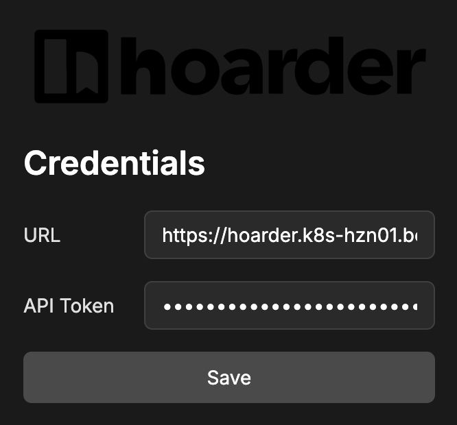
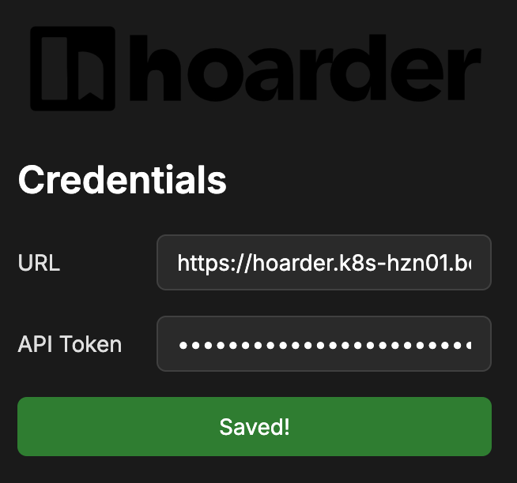
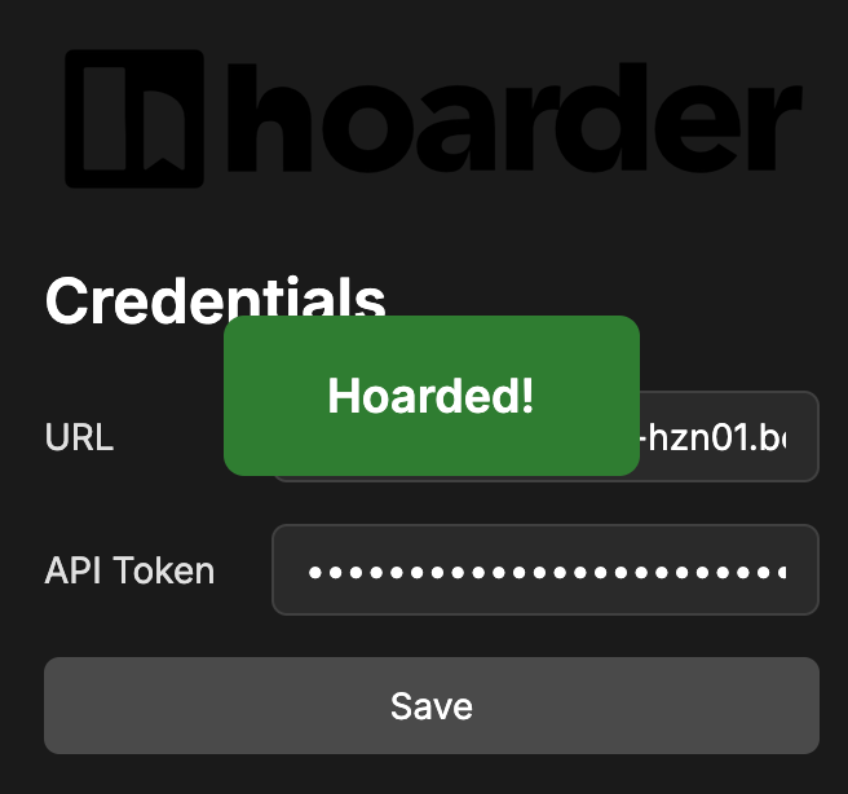

## hoarder firefox add-on

i tried the other only hoarder add-on for firefox and it just didn't work for (as also for others as seen in the issues).

so i quickly hacked this thing together, it's not pretty, but it works. :)

[Firefox Store
](https://addons.mozilla.org/de/firefox/addon/hoarder-app/?utm_source=addons.mozilla.org&utm_medium=referral&utm_content=search)

## screenshots

### basic ui

### after saving credentials

### after hoarding

